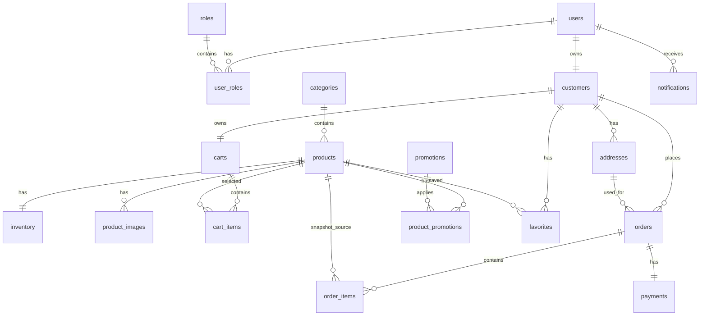

# Etape 3 - Modele de donnees PostgreSQL et entites Spring Boot

## 1. Objectif

Concevoir la base de donnees et les entites backend de la plateforme FreshMarket / Magasin Ziouziou.

Cette etape couvre :

- les tables PostgreSQL ;
- les relations ;
- les contraintes ;
- les statuts sous forme d'enums ;
- les migrations Flyway ;
- les entites JPA.

Aucun controleur metier, service applicatif ou ecran n'est developpe dans cette etape.

## 2. Decisions techniques

### 2.1 PostgreSQL comme source de verite

Les contraintes importantes sont placees en base :

- unicite des emails, slugs et SKU ;
- cles etrangeres ;
- contraintes de prix et quantites positives ;
- statuts autorises ;
- dates obligatoires.

Decision :

Le backend valide les donnees, mais la base garde aussi des protections. Cela evite qu'une erreur applicative laisse entrer des donnees incoherentes.

### 2.2 Flyway pour versionner la base

Les migrations sont placees dans :

```text
backend/src/main/resources/db/migration/
```

Migrations creees :

- `V1__create_identity_tables.sql`
- `V2__create_catalog_tables.sql`
- `V3__create_cart_order_payment_tables.sql`
- `V4__create_engagement_tables.sql`

Decision :

Flyway permet de reproduire la meme base en developpement, test, preproduction et production.

### 2.3 BigDecimal pour les montants et quantites

Les prix, totaux, reductions et quantites utilisent :

- PostgreSQL : `NUMERIC(12, 3)`
- Java : `BigDecimal`

Decision :

On evite `double` et `float`, car ils peuvent produire des erreurs d'arrondi sur les montants.

### 2.4 Prix de commande historise

`order_items` contient :

- `product_name`
- `unit_label`
- `unit_price`
- `quantity`
- `line_total`

Decision :

Une commande doit rester correcte meme si le produit change de nom ou de prix apres l'achat.

## 3. Vue globale du modele



## 4. Tables principales

### 4.1 Identite

Tables :

- `users`
- `roles`
- `user_roles`
- `customers`
- `addresses`

Regles :

- un email est unique ;
- un utilisateur peut avoir plusieurs roles ;
- un client correspond a un utilisateur ;
- un client peut avoir plusieurs adresses ;
- une adresse peut etre marquee comme adresse par defaut.

Roles initiaux :

- `ROLE_CLIENT`
- `ROLE_ADMIN`

### 4.2 Catalogue

Tables :

- `categories`
- `products`
- `product_images`
- `inventory`

Regles :

- une categorie peut contenir plusieurs produits ;
- un produit appartient a une seule categorie ;
- un produit a un slug unique ;
- un produit peut avoir un SKU unique ;
- un produit possede une ligne de stock ;
- le prix ne peut pas etre negatif ;
- la quantite de stock ne peut pas etre negative.

Categories issues des documents :

- boissons ;
- entretien ;
- hygiene ;
- bebe ;
- produits frais ;
- laiterie ;
- charcuterie ;
- traiteur ;
- epicerie seche ;
- snacking ;
- gaz.

### 4.3 Panier

Tables :

- `carts`
- `cart_items`

Regles :

- un client possede un panier ;
- un panier contient plusieurs lignes ;
- un meme produit ne peut apparaitre qu'une seule fois dans le meme panier ;
- la quantite doit etre strictement positive.

### 4.4 Commandes

Tables :

- `orders`
- `order_items`

Statuts :

- `PENDING`
- `CONFIRMED`
- `PREPARING`
- `READY`
- `OUT_FOR_DELIVERY`
- `DELIVERED`
- `CANCELLED`

Regles :

- une commande appartient a un client ;
- une commande peut referencer une adresse ;
- une commande contient plusieurs lignes ;
- les prix sont copies au moment de l'achat ;
- une commande possede un numero unique ;
- les montants ne peuvent pas etre negatifs.

### 4.5 Paiement

Table :

- `payments`

Methodes :

- `CASH_ON_DELIVERY`
- `ONLINE_CARD`

Statuts :

- `UNPAID`
- `PAID`
- `FAILED`
- `REFUNDED`

Decision :

La V1 utilisera surtout `CASH_ON_DELIVERY`. `ONLINE_CARD` est reserve pour une evolution future.

### 4.6 Promotions

Tables :

- `promotions`
- `product_promotions`

Types :

- `PERCENTAGE`
- `FIXED_AMOUNT`

Regles :

- une promotion a une date de debut et une date de fin ;
- la date de fin doit etre apres la date de debut ;
- la valeur de reduction doit etre positive ;
- une promotion peut s'appliquer a plusieurs produits ;
- un produit peut avoir plusieurs promotions, mais la strategie de cumul sera definie plus tard dans les services metier.

### 4.7 Favoris

Table :

- `favorites`

Regles :

- un client peut ajouter plusieurs produits en favoris ;
- un meme produit ne peut etre favori qu'une seule fois par client.

### 4.8 Notifications

Table :

- `notifications`

Types :

- `ORDER_STATUS`
- `PROMOTION`
- `SYSTEM`

Regles :

- une notification appartient a un utilisateur ;
- `read_at` vaut `NULL` tant que la notification n'est pas lue.

## 5. Entites JPA creees

Package `domain.common` :

- `BaseEntity`

Package `domain.identity` :

- `User`
- `Role`

Package `domain.customer` :

- `Customer`
- `Address`

Package `domain.catalog` :

- `Category`
- `Product`
- `ProductImage`
- `Inventory`

Package `domain.cart` :

- `Cart`
- `CartItem`

Package `domain.order` :

- `Order`
- `OrderItem`
- `OrderStatus`

Package `domain.payment` :

- `Payment`
- `PaymentMethod`
- `PaymentStatus`

Package `domain.promotion` :

- `Promotion`
- `DiscountType`

Package `domain.favorite` :

- `Favorite`

Package `domain.notification` :

- `Notification`
- `NotificationType`

## 6. Points volontairement non developpes

Les elements suivants seront traites dans les prochaines etapes :

- repositories Spring Data ;
- services applicatifs ;
- DTO ;
- controllers REST ;
- logique de calcul de panier ;
- logique de confirmation de commande ;
- authentification complete ;
- seed de donnees categories/produits ;
- tests d'integration PostgreSQL.

## 7. Checklist de validation

- [ ] Les tables proposees couvrent le MVP.
- [ ] Les relations client, catalogue, panier et commande sont validees.
- [ ] Les statuts de commande sont acceptes.
- [ ] Les modes et statuts de paiement sont acceptes.
- [ ] Les promotions et favoris sont gardes pour le MVP ou repousses.
- [ ] Les migrations Flyway sont acceptees.
- [ ] Les entites JPA sont acceptees.
- [ ] L'etape 4 peut commencer : creation des repositories, DTO et contrats API.

